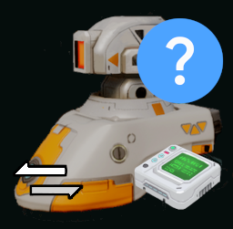

# Passable Instruction Mod for Desynced

## Overview

The **Passable Instruction Mod** introduces a new behavior instruction that allows entities in the game to determine whether a specified *visible* coordinate is passable for unit movement. This feature can enhance automation and decision-making in gameplay.

## Instruction Details

- **Name**: Is passable [PASSABLE]
- **Description**: Determines whether a *visible* coordinate can be traversed by units.
- **Category**: Move
- **Arguments**:
    1. **Coordinate**: *Visible* coordinate to check for passability.
- **Execution flows**:
  1. **Default**: When no coordinate was set or the location is *not visible*.
  2. **Impassable**: When there is an obstacle at the coordinate.
  3. **Passable**: When the coordinate is traversable.

## Installation

1. Clone or download the mod from the [GitHub repository](https://github.com/t0suj4/mod_passable_instruction) or get it from [Steam Workshop](https://steamcommunity.com/sharedfiles/filedetails/?id=3441787707)
2. Place the mod files in the appropriate mod directory for Desynced.
3. Ensure the mod is enabled in the game's mod manager.

